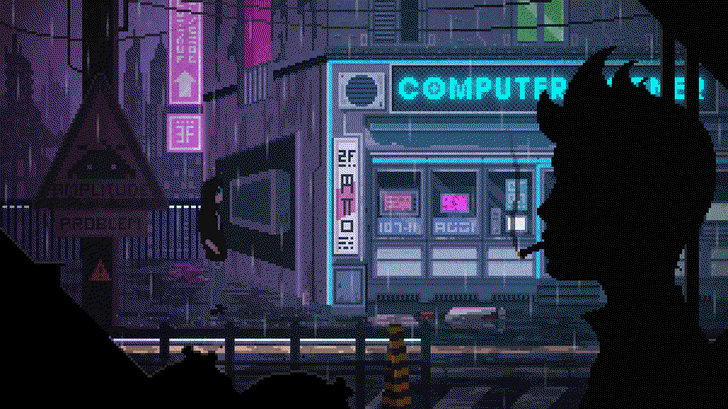

  

<h2 dir="rtl" align="center">
<strong>Hi there 👋 Im Alireza</strong>
</h2>

### 💢 About Me :
> I am Alireza, passionate about the world of zeros and ones. I have always strived to do my best in everything I undertake and create value in every task I perform.
> As a back-end developer and Penetration Tester with over 4 years of experience, I am constantly seeking to learn and embrace new experiences. This passion for learning and new challenges has driven me to face various challenges, aiding in my personal and professional growth.

📚 Bachelor's degree in electrical engineering

💢My ultimate goal is to help people who aspire to achieve great things but face various limitations.

 

### 🔐 My Skills :

- 🌀 Wordpress Back-end Developer (PHP / Theme Developer)
- 🌀 Python programmer and Django Back-end Developer
- 🌀 Penetration Testing and Security of Web Applications (OWASP / WSTG)

 

### 🔰 My Social Media :

 
Information Gathering Write-up

### ⚙️ My projects  :
| Project Name | Project link | Stars |
| ----------- | ----------- | ----------- |
| An introduction to the Python programming language | [Link](https://github.com/graymicro/introduction-to-the-Python-programming-language) |**** |
|Information Gathering Write-up| [Link](https://github.com/graymicro/Information-Gathering-Write-up) |**** |
